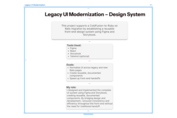
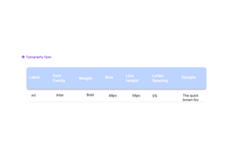
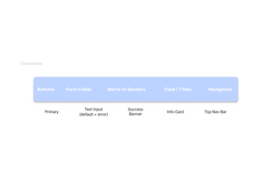
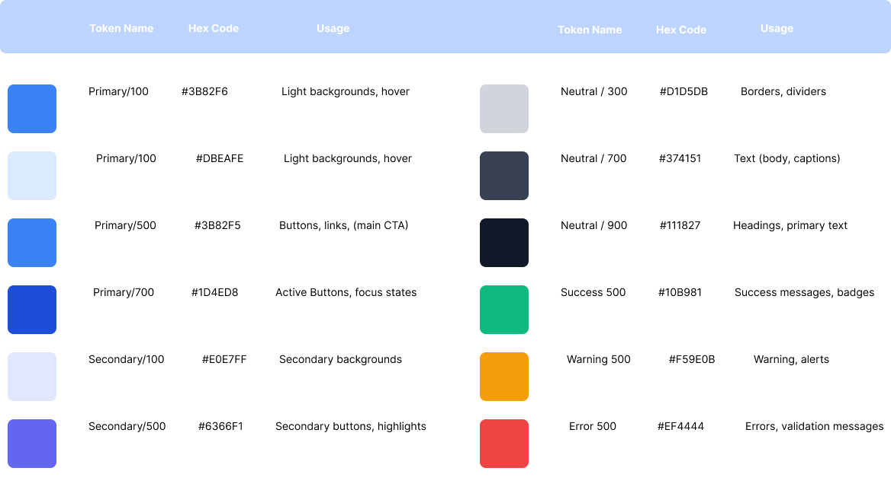
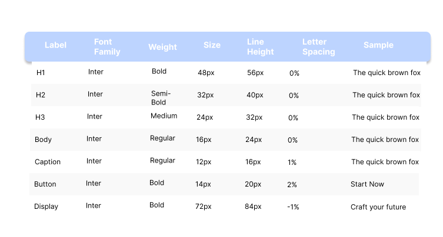
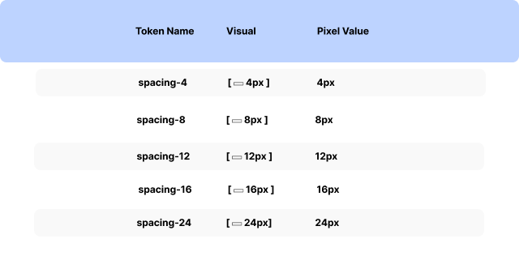
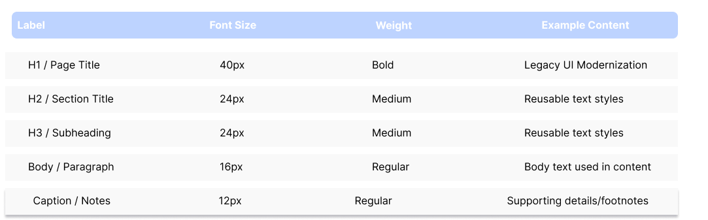

# 🖥️ Legacy UI Modernization – Figma Design System

This design system supports a ColdFusion-to-Ruby on Rails migration by normalizing UI elements across old and new pages. Built in **Figma** and documented with **Storybook**, it accelerates frontend development through reusable, consistent components.

---

## 🔧 Tools Used

- Figma  
- React  
- Storybook  
- Tailwind CSS (optional)

---

## 🎯 Goals

- Normalize UI across legacy and new Rails pages  
- Create reusable, documented components  
- Speed up front-end handoffs using shared specs and tokens

---

## 👩‍💻 My Role

I designed and implemented the full front-end UI system using Figma and Storybook. My process focused on component modularity, visual consistency, and clean developer handoff—eliminating the need for traditional spec sheets.

---

## 🔠 Typography Spec

This system uses the Inter font family, optimized for readability and scalability. The table below defines the primary type hierarchy:

---

## 🧩 Component Library

The design system includes a broad set of components, structured for responsive, accessible use:

**Includes:**

- Buttons (primary, ghost, icon)  
- Form fields and inputs  
- Banners and alerts  
- Cards, headers, and CTAs  
- Navigation menus and tab structures  
- Toasts, modals, and more

---

## 🛠 Developer Handoff Ready

Each component in Figma is:

- Built with Auto Layout + Variants  
- Fully annotated for dev inspection  
- Linked to working React counterparts via Storybook

---

---
<!--
## 📸 Figma Design Previews

### 🎨 Color System  
  
[🔗 View full-size](assets/color-system.png)

### 🔠 Typography  
  
[🔗 View full-size](assets/typography.png)

### 📏 Spacing Grid  
  
[🔗 View full-size](assets/spacing-grid.png)

### 🧩 Components  
  
[🔗 View full-size](assets/components.png)

### 🧰 UI Kit  
  
[🔗 View full-size](assets/ui-kit.png)
-->
---

## 🔗 View the Figma File (Read-Only)
[📂 Open the Legacy UI Modernization Prototype](https://www.figma.com/proto/PCImvlHNBhGuZlvZiX1QsU/Legacy-UI-Modernization---Design-System?node-id=1-4&t=jmw3ieWfiA7L5cNJ-1)

---

## 📁 Related Projects

- [Bio Health Data Explorer](https://github.com/yourusername/bio-health-data-explorer)  
- [Finance Dashboard UI](https://github.com/yourusername/personal-finance-dashboard)  
- [Patient Login Prototype](https://github.com/yourusername/patient-login-prototype)

---

## 💡 Summary

This project demonstrates how I bridge UX/UI design with scalable front-end development. Figma plays a central role in system thinking, design consistency, and speed-to-code.
